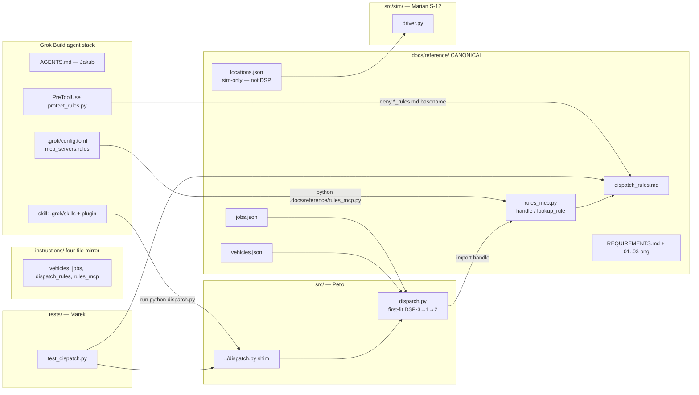
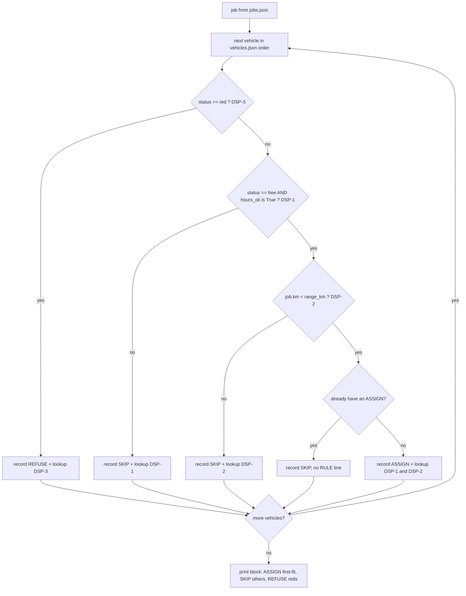
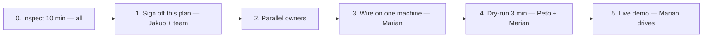

# Dispatch Desk — Requirements Analysis & System Architecture

| Field | Value |
|---|---|
| **Document** | Dispatch Desk (Grok Enablement Workshop Track 4.1) |
| **Author** | Jakub (architect) / Grok Build `/plan` work product |
| **Date** | 2026-09-18 |
| **Status** | Draft — revision 2026-09-18 (user: **all data are in reference**). Canonical client pack is `.docs/reference/`. Awaiting team sign-off before engine path changes. |
| **Repo** | `C:\Users\P3503318\Desktop\DispatchProject` |
| **Audience** | Ondrej (dev), Marek (QA auto), Peťo (QA acceptance), Marian (integration + live demo) |
| **Durable copy** | `.docs/specification/architecture.md` |
| **Session plan** | Grok Build `plan.md` is ephemeral; this file is the source of truth |

**Revision (user: all data in reference):** `.docs/reference/` is the canonical client/data pack. Engine, MCP `handle()`, and sim load from there. `instructions/` is a workshop-shaped **mirror** of the four assignment files only. `locations.json` is sim-only (S-13, done). Frozen J-01/J-02 → T-11 outcomes unchanged.

**Gate:** Do not invent T-15 or DSP-5. Do not put lat/lon in `locations.json`. Do not use `locations.json` in `evaluate_vehicle` / `dispatch_job`. Do not edit kit files except to keep the four-file `instructions/` mirror text-equal to reference if both exist.

---

## Overview

The lab asks for a **live dispatch desk**, not slides. Inputs are a three-vehicle roster and a two-job queue. For each job the engine assigns the first vehicle that is free, inside operating hours, and strictly within range. Vehicle T-14 is always refused as out of service. Every cited sentence must come from MCP `lookup_rule` / `rules_mcp.handle()`, never from model memory and never from hardcoded DSP strings.

This repository’s **canonical client pack** is `.docs/reference/` (brief, screenshots, roster, queue, rule book, MCP stub, sim geography). `instructions/` is a workshop-shaped **mirror** of the four assignment files only (no `locations.json`). Implementation belongs in `src/` and `tests/`. The Grok agent stack (AGENTS.md, project + plugin skill, project + plugin PreToolUse hook, **project-scoped** MCP server) is what the jury must see on the laptop. The runtime that actually assigns jobs is a **deterministic Python script**. The model is an operator, not the assignment algorithm. Charging / speed / junctions / kW are Layer B telemetry **after** ASSIGN.

Expected kit outcomes (non-negotiable):

| Job | T-11 free 180 km | T-12 busy 90 km | T-14 red 200 km | Result |
|---|---|---|---|---|
| J-01 Cluj 40 km | eligible (40 < 180) | skip (busy / DSP-1) | refuse (red / DSP-3) | **ASSIGN T-11**, cite DSP-1 and DSP-2 |
| J-02 Oradea 160 km | eligible (160 < 180) | skip (busy / DSP-1; range would also fail) | refuse (red / DSP-3) | **ASSIGN T-11**, cite DSP-1 and DSP-2 |

T-11 is the only eligible vehicle. T-12 is never assigned. T-14 is never assigned. Roster status is **not** mutated between jobs — both jobs independently assign T-11, matching the workshop decision table.

---

## Background & Motivation

### Why this change exists

Track 4.1 (https://grok-enablement-workshop.grok.me/modules/hackathon/fleet) is a Grok Enablement exercise: stand up an agent that dispatches from kit files only, prove the must-show list on a laptop, and end with a live run. The kit is already in this repo. What is missing is everything the jury grades: inspect evidence, a plan, AGENTS.md, a skill, a hook, MCP `lookup_rule`, a re-runnable script, and a test that T-14 stays refused.

### Current state (2026-09-18)

Canonical pack already on disk under `.docs/reference/` (see inventory below). `src/sim/driver.py` already loads `.docs/reference/locations.json` (S-13 **done**). `.grok/config.toml` currently spawns `instructions/rules_mcp.py` — retarget args to `.docs/reference/rules_mcp.py` so `RULE_FILE` is the canonical rule book (do not rewrite `command` to `python3`).

```
DispatchProject/
  instructions/          # workshop mirror of four assignment files — not the source of truth
  src/sim/driver.py      # S-12; loads .docs/reference/locations.json
  .docs/TEAM.md
  .docs/reference/       # CANONICAL client/data pack (Jakub analyzes this)
  .docs/specification/   # this architecture
  .grok/config.toml      # [mcp_servers.rules] command=python; retarget args to reference
```

### Pain points this architecture removes

1. **Kit layout vs. this repo.** Workshop slides assume kit files at folder root. **This repo’s source of truth is `.docs/reference/`.** `instructions/` is a four-file mirror for lab inspect muscle-memory. Paths, MCP args, and `handle()` imports point at **reference**.
2. **`python3` does not run on this laptop.** `python3` is a zero-byte Microsoft Store alias (`C:\Users\P3503318\AppData\Local\Microsoft\WindowsApps\python3.exe`) that prints "Python was not found". Real interpreter: `python` → `C:\Users\P3503318\AppData\Local\Programs\Python\Python313\python.exe` (3.13.13). TEAM.md and the workshop command both say `python3`; every runnable artifact on this machine must use `python`.
3. **LLM-in-the-loop assignment would fail the lab.** The model must not invent T-15 / DSP-5, must not dump the whole rule file, and must not paraphrase DSP-3. A 40-line deterministic engine plus `handle()` is the only way to make T-14 refuse reproducible.
4. **Must-show is a product constraint, not a README.** Inspect, plan, AGENTS.md, skill, hook, MCP, script, and test all have to be visible in 3–4 minutes.

### Authoritative sources (do not contradict)

| Source | Path / URL | Role |
|---|---|---|
| Workshop brief | https://grok-enablement-workshop.grok.me/modules/hackathon/fleet | Client brief (also REQUIREMENTS.md) |
| **Canonical pack** | `.docs/reference/` | **All** client artifacts — see inventory |
| Lab flow | `.docs/reference/01-lab.png` | Inspect → Plan → Rebuild → Live demo |
| Decision table | `.docs/reference/02-rozhodnutie.png` | DSP-1→4, J-01/J-02 → T-11, T-14 refuse DSP-3 |
| Must-show | `.docs/reference/03-ukaz.png` | 8 items + Hotovo A/B/C |
| Team split | `.docs/TEAM.md` | Owners, demo order, "do not" list |
| S-13 / S-00 | `.docs/stories/S-13-locations-data.md` | locations.json sim-only; **done** |
| Grok conventions | `%USERPROFILE%\.grok\docs\user-guide\` | Skills, hooks, plugins, MCP, AGENTS.md, plan mode |

If `instructions/` and `.docs/reference/` disagree on the four assignment files, **reference wins**.

### Canonical data (`.docs/reference/`)

Every client artifact lives here. This is the pack Jakub analyzes. Do not send implementers to invent files.

| File | Role | Loaded by |
|---|---|---|
| `REQUIREMENTS.md` | Client brief | Humans / inspect |
| `01-lab.png` | Inspect → Plan → Rebuild → Live demo | Inspect / show_lab |
| `02-rozhodnutie.png` | Decision table | Inspect / this plan |
| `03-ukaz.png` | Must-show + Hotovo A/B/C | Inspect / show_lab |
| `vehicles.json` | Roster T-11 / T-12 / T-14 | `load_vehicles()` |
| `jobs.json` | Queue J-01 Cluj 40, J-02 Oradea 160 | `load_jobs()` |
| `dispatch_rules.md` | DSP-1..DSP-4 only | `handle()` via PREFERRED |
| `rules_mcp.py` | MCP stub + importable `handle()` | Engine import + Grok MCP spawn |
| `locations.json` | Driver-sim geography + charger power. `role: driver-simulation-only`, `not_a_dispatch_rule: true` | `src/sim/driver.py` only |

`locations.json` is **not** a DSP rule and **not** an eligibility input. Distance table, not GPS. Do not invent lat/lon. S-13 is **done**.

---

## Goals & Non-Goals

### Goals

1. Deterministic assignment of J-01 and J-02 to T-11 with DSP-1 and DSP-2 quotes sourced from `handle()`.
2. Deterministic T-14 refuse with DSP-3 quote sourced from `handle()`.
3. Re-runnable CLI: `python dispatch.py` (both jobs) and `python dispatch.py J-01`.
4. Unittest: `python -m unittest test_dispatch -v` — T-14 never assigned, T-12 never assigned, quotes ⊆ `.docs/reference/dispatch_rules.md`.
5. Grok agent stack visible on the laptop: inspect, AGENTS.md, this plan, skill, PreToolUse hook, MCP `lookup_rule`, script, test.
6. Plugin pack of **skill + hook** at `.grok/plugins/dispatch-desk/`, **and** the same skill + hook at project `.grok/skills/` + `.grok/hooks/` (TEAM.md belt-and-suspenders). Live MCP stays project-scoped (`.grok/config.toml`); plugin does **not** ship `.mcp.json` in v1.
7. 3–4 minute live demo driven by Marian, with CLI as the fallback if any UI dies.
8. Windows-correct interpreter and paths.

### Non-goals (must not be built)

| Non-goal | Why |
|---|---|
| Copying workshop HTML / a fancy SPA | TEAM.md: "pôvodné UI, **nekopírovať** workshop HTML". Optional thin `dispatch_server.py` only. |
| Invented vehicles (T-15, T-13, …) | DSP-4 |
| Invented rules (DSP-5, extra markdown) | Brief: "Do not invent a rule file" |
| Editing kit files | TEAM.md "Čo nerobiť" |
| Reverse-engineering dump folder | TEAM.md |
| LLM chooses the vehicle | Non-deterministic; fails T-14 test |
| Hardcoded DSP sentences in `dispatch.py` | Quotes must come from `handle()` |
| Mutating roster after J-01 | Decision table assigns T-11 to **both** jobs |
| Production auth, multi-tenant, persistence, GPS, payments | Lab only; "No real customer data. No medical, legal, or payment advice." |
| Scoring / nearest-vehicle optimizer | One eligible vehicle; first-fit is enough |
| Dumping the whole rule file on a lookup miss | `rules_mcp.py` returns `No rule line matched …` by design |
| Starting AGENTS.md / script before this plan is approved | TEAM.md gate |
| **DSP-5 “must charge to assign”** | Charging is telemetry **after** ASSIGN (S-13 / S-00). `locations.json` is not an eligibility input |
| lat/lon or a GPS map in `locations.json` | Distance table only |

---

## Requirements Analysis

Requirement IDs are the contract. Every ID maps to a component and to test or demo evidence in the traceability matrix.

### Functional requirements

| ID | Requirement | Source | Owner |
|---|---|---|---|
| **FR-1** | Load roster only from `.docs/reference/vehicles.json`. Fields used: `id`, `status`, `hours_ok`, `range_km`. | Canonical pack, DSP-4 | Peťo |
| **FR-2** | Load queue only from `.docs/reference/jobs.json`. Fields used: `id`, `city`, `km`. | Canonical pack | Peťo |
| **FR-3** | Process jobs in JSON order. CLI with no args = all jobs; CLI with one id = that job only. | TEAM.md | Peťo |
| **FR-4** | Evaluate vehicles in JSON order (T-11, T-12, T-14). First eligible vehicle is assigned (first-fit). | 02-rozhodnutie.png | Jakub / Peťo |
| **FR-5 DSP-1** | Eligible only if `status == "free"` **and** `hours_ok is True`. Otherwise skip (do not assign). | `dispatch_rules.md` | Peťo |
| **FR-6 DSP-2** | Eligible only if `job.km < vehicle.range_km` (strict less-than). | `dispatch_rules.md` | Peťo |
| **FR-7 DSP-3** | If `status == "red"`, refuse that vehicle. Do not assign. Cite DSP-3. Short-circuit: do not cite DSP-1/DSP-2 for a red vehicle even if those would also fail. | `dispatch_rules.md`, 02-rozhodnutie.png, Hotovo B | Peťo |
| **FR-8 DSP-4** | Never construct a vehicle id that is not in `vehicles.json`. CLI unknown job id → error, not an invented job. | `dispatch_rules.md` | Peťo |
| **FR-9** | J-01 (Cluj, 40 km) → ASSIGN T-11. | Decision table | Peťo / Marek |
| **FR-10** | J-02 (Oradea, 160 km) → ASSIGN T-11. | Decision table | Peťo / Marek |
| **FR-11** | T-12 is never ASSIGN. Skip with DSP-1 (busy). | Decision table | Marek |
| **FR-12** | T-14 is never ASSIGN, for J-01 and for J-02. Always REFUSE with DSP-3. | Hotovo B, TEAM.md | Marek |
| **FR-13** | ASSIGN T-11 cites DSP-1 and DSP-2, in that order. | 02-rozhodnutie.png | Peťo |
| **FR-14** | Every quoted line is the exact `lookup_rule` hit, obtained by importing `handle` from `.docs/reference/rules_mcp.py` and calling `method="tools/call"`, `name="lookup_rule"`. | TEAM.md, rules_mcp.py | Jakub sign-off / Peťo |
| **FR-15** | Stdout is human-readable for the demo and parseable for tests (contract in § API). | TEAM.md | Peťo / Marek |
| **FR-16** | Re-runnable: `python dispatch.py` and `python dispatch.py J-01`. | Must-show 7 | Peťo |
| **FR-17** | MCP tools `list_rules` and `lookup_rule` available to Grok as `rules__list_rules` / `rules__lookup_rule`. | Must-show 6, MCP naming | Jakub |
| **FR-18** | PreToolUse hook denies writes to `dispatch_rules.md` and `*_rules.md`. | TEAM.md, Peťo spec | Peťo spec / Jakub impl |
| **FR-19** | Optional thin HTTP wrapper `src/dispatch_server.py` calling the same engine. If it dies, demo continues on the CLI. | TEAM.md | Marian |
| **FR-20** | `python pipelines/show_lab.py` prints the must-show paths. `.ps1` / `.sh` wrappers are optional and **not** the spoken demo command. | TEAM.md | Jakub / Peťo |
| **FR-21** | `.docs/reference/locations.json` is Layer B only. Driver nearest-charger: `min` `km_from[city]` among stations with `km_from[city] <= remaining_range`. CS-4 is an unreachable trap. **Never** read this file in `evaluate_vehicle` / `dispatch_job`. | S-13 (done), S-00 | Marian / `src/sim/driver.py` |

### Non-functional requirements

| ID | Requirement | Source |
|---|---|---|
| **NFR-1** | Deterministic: same inputs → same stdout. No wall-clock, no RNG, no model in the assigner. | Lab |
| **NFR-2** | Latency: full two-job run < 200 ms on this laptop (local JSON + in-process `handle()`). | Demo |
| **NFR-3** | Demo fit: live path (inspect → script → test → MCP) ≤ 4 minutes. | TEAM.md |
| **NFR-4** | Windows runner: all documented commands use `python`, not `python3`. | This machine |
| **NFR-5** | Stdout UTF-8. Tests accept both LF and CRLF (`splitlines()`). | Windows |
| **NFR-6** | No network required at demo time (MCP is local stdio; engine is local files). | Lab |
| **NFR-7** | `.docs/reference/` assignment files are immutable first (C-1). If `instructions/` exists, newline-normalized text-equal to the four assignment files in reference (`git diff --ignore-cr-at-eol`). **Never SHA256.** If they drift, **reference wins**. `locations.json` lives only in reference. | C-1, KD-8 |
| **NFR-8** | Folder trust required for project AGENTS.md, skills, hooks, project MCP, project plugins (`--trust` / `/hooks-trust`). | Grok user-guide 07/08/09/10/12 |
| **NFR-9** | Fail closed on quote miss: if `lookup_rule` returns `No rule line matched …`, the process exits non-zero and does not invent a sentence. | rules_mcp.py comment |
| **NFR-10** | No PII, no medical/legal/payment content. Synthetic kit ids only. | Brief |

### Constraints / invariants

| ID | Invariant | Enforcement |
|---|---|---|
| **C-1** | Canonical assignment files under `.docs/reference/` are immutable: `dispatch_rules.md`, `vehicles.json`, `jobs.json`, `rules_mcp.py`, plus sim-only `locations.json` (schema frozen, S-13 done). `instructions/` mirror of the four assignment files is also not a playground. | AGENTS.md + PreToolUse hook + human review. Do not "fix" the shebang. Do not add lat/lon. |
| **C-2** | Quotes ⊆ lines of `.docs/reference/dispatch_rules.md`. No paraphrases. | Marek test; `handle()` is the only quote source |
| **C-3** | `dispatch.py` must not contain the DSP sentence bodies as string literals (e.g. `"Status red is out of service"`). Rule **ids** (`"DSP-3"`) as lookup queries are allowed. | Marek source grep |
| **C-4** | Import `handle` from the canonical module `.docs/reference/rules_mcp.py`, not a copy under `src/` and not the `instructions/` mirror. `RULE_FILE` is resolved **next to that module** via `PREFERRED = (payer_rules.md, dispatch_rules.md, rights_rules.md, policy-excerpt.md)` then a skip-list fallback — that is `.docs/reference/dispatch_rules.md`. A copied module would look beside the copy and miss the rule file. | Code review / Jakub sign-off |
| **C-5** | Do not mutate vehicle `status` after assignment. J-01 and J-02 both see T-11 as free. | Engine design; test FR-9 and FR-10 together |
| **C-6** | DSP evaluation order is DSP-3 (red) → DSP-1 (free ∧ hours_ok) → DSP-2 (km < range). DSP-4 is structural (iteration universe). | This document |
| **C-7** | T-14 is reported as `REFUSE` (reserved word), never `SKIP` and never `ASSIGN`. | Stdout contract |
| **C-8** | T-12 is reported as `SKIP`, never `ASSIGN`. | Stdout contract |
| **C-9** | Grok MCP tool names are `server__tool` → `rules__lookup_rule`. | User-guide 07 |
| **C-10** | Hooks fail-open unless they emit an explicit `{"decision":"deny"}`. The protect-rules hook must succeed and deny; a crash is a demo miss. | User-guide 10 |
| **C-11** | Project skills/hooks/MCP/plugins require folder trust. | User-guide |
| **C-12** | `python3` is forbidden in runnable commands on this laptop. Docs may mention the workshop spelling and immediately map it to `python`. | Verified 2026-09-18 |

### Must-show acceptance criteria

Mapped from `.docs/reference/03-ukaz.png` and the workshop brief. Evidence is what Peťo ticks on the laptop.

| ID | Must-show | Laptop evidence | Owner during demo |
|---|---|---|---|
| **MS-1** | inspect | List `.docs/reference/` **before** claiming we wrote files: four assignment files + `locations.json` + `REQUIREMENTS.md` + screenshots 01–03. `show_lab.py` reprints that list. `instructions/` may be shown as the four-file mirror. | Peťo |
| **MS-2** | AGENTS.md | Repo-root `AGENTS.md` exists; `grok inspect` lists it as a project instruction. Short: inspect first, only `dispatch_rules.md`, no invented vehicles, refuse red, quotes via lookup_rule, `python` not `python3`. | Jakub |
| **MS-3** | plan | This document + Grok `/plan` approval. Do not start implementation files before sign-off. | Jakub |
| **MS-4** | skill | **Both** `.grok/skills/dispatch-desk/SKILL.md` **and** `.grok/plugins/dispatch-desk/skills/dispatch-desk/SKILL.md`. YAML frontmatter `name` + `description`. Steps: inspect → lookup_rule → `python dispatch.py` → cite DSP. Project skill covers the 3-minute demo if the plugin is off/untrusted. | Jakub |
| **MS-5** | hook | **Both** `.grok/hooks/` **and** plugin `hooks/`. PreToolUse JSON + Python checker. Deny writes to `dispatch_rules.md` and `*_rules.md` via basename on `file_path`/`path`/`target_file`/`old_string`. `/hooks` shows it loaded. Live: ask Grok to `search_replace` or `write` the rule file; it is denied. | Peťo spec / Jakub impl |
| **MS-6** | MCP lookup_rule | `grok mcp list` shows `rules (project)`. Grok calls `rules__lookup_rule` with query `DSP-3` and gets the kit line. | Jakub |
| **MS-7** | script | `python dispatch.py` assigns J-01 and J-02 to T-11 with quotes. | Peťo |
| **MS-8** | test T-14 stays refused | `python -m unittest test_dispatch -v` — fail if T-14 is ever ASSIGN. | Marek |

**Hotovo (done when):**

| ID | Criterion | Evidence |
|---|---|---|
| **MS-A** | Eligible vehicle assigned (T-11) + quote from rule file | Script stdout ASSIGN T-11 + DSP-1/DSP-2 lines ⊆ kit file |
| **MS-B** | T-14 refuse, cite DSP-3 (out of service) | Script stdout REFUSE T-14 + DSP-3 line from `handle()` |
| **MS-C** | Live script on the laptop; no invented rules | No slides; kit file unchanged; no DSP-5 |

### Expected outcomes (frozen)

Vehicle facts (do not "improve" them):

```json
[
  {"id": "T-11", "status": "free", "hours_ok": true,  "range_km": 180},
  {"id": "T-12", "status": "busy", "hours_ok": true,  "range_km": 90},
  {"id": "T-14", "status": "red",  "hours_ok": false, "range_km": 200}
]
```

Job facts:

```json
[
  {"id": "J-01", "city": "Cluj",   "km": 40},
  {"id": "J-02", "city": "Oradea", "km": 160}
]
```

Rule lines (the only legal quotes), verified via `handle()` on 2026-09-18:

| Query | `handle()` lookup_rule body |
|---|---|
| `DSP-1` | `DSP-1. Assign only a vehicle with status free and hours_ok true.` |
| `DSP-2` | `DSP-2. Job distance must be less than vehicle range_km.` |
| `DSP-3` | `DSP-3. Status red is out of service. Do not assign. Quote this rule.` |
| `DSP-4` | `DSP-4. Do not invent a vehicle that is not in vehicles.json.` |
| `T-15` | `No rule line matched 't-15'.` (engine must not use this as a quote) |

Per-vehicle evaluation (same for both jobs unless noted):

| Vehicle | DSP-3 red? | DSP-1 free∧hours_ok? | DSP-2 km < range | Outcome |
|---|---|---|---|---|
| T-11 | no | yes | J-01: 40<180 yes; J-02: 160<180 yes | **ASSIGN** both jobs; cite DSP-1, DSP-2 |
| T-12 | no | no (busy) | J-01: 40<90 yes (not reached); J-02: 160<90 no (not reached) | **SKIP**; cite DSP-1 only |
| T-14 | **yes** | no (also hours_ok false) | 40<200 and 160<200 would pass (not reached) | **REFUSE**; cite DSP-3 only |

Why T-14 quotes DSP-3 even though DSP-1 also fails: DSP-3 is the specific out-of-service rule the lab requires quoting ("Quote this rule."). Short-circuit on `status == "red"` so the demo line is always DSP-3, never a DSP-1 paraphrase.

---

## Key Decisions

| ID | Decision | Rationale |
|---|---|---|
| **KD-1** | Assignment is a **deterministic script**, not LLM-in-the-loop. | T-14 test must pass every time. Model is the operator (inspect, lookup_rule, run script). |
| **KD-2** | **First-fit** in `vehicles.json` order. No scoring. First-fit lives **only** in `dispatch_job` (see KD-17). | Only T-11 is eligible. Scoring would add code and invite invented criteria. |
| **KD-3** | **Do not mutate roster.** J-01 and J-02 both assign T-11. | Frozen by 02-rozhodnutie.png. Mutating T-11 to busy after J-01 would leave J-02 with no eligible vehicle and contradict the table. |
| **KD-4** | Evaluation order **DSP-3 → DSP-1 → DSP-2**. DSP-4 is the iteration universe. | Guarantees T-14 cites DSP-3 even though `hours_ok` is false. |
| **KD-5** | Stdout vocabulary: `ASSIGN` / `SKIP` / `REFUSE`. T-14 is always `REFUSE`; T-12 is always `SKIP` **and is printed** (not optional). | Closed (was Q-1). Distinguishes out-of-service from busy. Hotovo A and B on one command. |
| **KD-6** | Quotes **only** via `from rules_mcp import handle` + `tools/call` `lookup_rule`. Query = `"DSP-1"` … `"DSP-4"`. | TEAM.md sign-off item. Verified hits on this kit. |
| **KD-7** | Engine lives in `src/dispatch.py`. Root `dispatch.py` and `test_dispatch.py` are **thin shims**. Tests and the shim both `sys.path.insert(src)` then `import dispatch` (one module object). No `src/__init__.py`. Never `import src.dispatch`. | Closed (was Q-10). TEAM.md CWD commands + this repo's `src/` / `tests/` layout. Dual import identity is forbidden (R-11). |
| **KD-8** | **Canonical data path is `.docs/reference/`.** `load_vehicles` / `load_jobs` read `.docs/reference/vehicles.json` and `.docs/reference/jobs.json`. Quotes via `handle()` imported from `.docs/reference/rules_mcp.py` so `RULE_FILE` is `.docs/reference/dispatch_rules.md` via `PREFERRED`. MCP args = `.docs/reference/rules_mcp.py`. Sim loads `.docs/reference/locations.json` only. `instructions/` is a four-file **mirror**, not the source of truth; it must not contain `locations.json`. If the trees drift, **reference wins**. | User decision 2026-09-18: “all data are in reference.” Workshop inspect historically named four kit files; the mirror preserves that shape. |
| **KD-9** | Runnable commands use **`python`**, never `python3`, on this laptop. Pin full `Python313\python.exe` in MCP **and hook** at the first `grok mcp doctor` / hook-spawn failure — not as a surprise mid-demo. | `python3` is a Store stub. `where.exe python` also lists `WindowsApps\python.exe` **after** 3.13; Grok spawn PATH can hit the stub (R-10). |
| **KD-10** | **One live MCP:** project `.grok/config.toml` `[mcp_servers.rules]` (already present; must-show 6). Plugin **omits** `.mcp.json` in v1. **Skill + hook ship twice:** project `.grok/skills/` + `.grok/hooks/` **and** `.grok/plugins/dispatch-desk/` (TEAM.md). | User-guide 07 merge order is config.toml > Claude > Cursor > **project-root** `.mcp.json`. Plugin `.mcp.json` is **not** in that table; duplicate name `rules` is unverified. Workshop “may pack MCP” is optional; packing skill+hook still satisfies the plugin must-show. Project copies keep MS-4/MS-5 if the plugin is off (plugins default off; need trust+enable). |
| **KD-11** | Hook is **Python**, not bash. Matcher: `write\|Write\|Edit\|search_replace\|Bash\|run_terminal_command`. Command uses `${GROK_PLUGIN_ROOT}` / `${GROK_WORKSPACE_ROOT}` so the script is found. Deny on **basename** of `file_path`/`path`/`target_file`/`old_string` matching `dispatch_rules.md` or `*_rules.md`. Do **not** parse `toolInput.command`. | Fail-open if the script is missing (cwd ≠ hook dir). Matcher is not documented case-insensitive; `Write` misses `write`. Dropping the unfinished shell write-position parser avoids both missing `python -c` writes and denying `Get-Content` reads. Live demo is `search_replace` / `write`. |
| **KD-12** | Demo primary path is the **CLI**. Optional `dispatch_server.py` is stdlib-only, generates its own tiny HTML, and is dropped without apology if it fails. `/api/dispatch` JSON is unspecified until PR-8. | TEAM.md fallback. Must-show 7 is the script. |
| **KD-13** | Spoken `show_lab` command is **`python pipelines/show_lab.py` only**. Optional `.ps1` / `.sh` wrappers may exist; do not type them in the demo (`ExecutionPolicy` can block `.ps1`; `./show_lab.sh` is not PowerShell). | Windows laptop. TEAM.md's `./show_lab.sh` is a POSIX alias, not the jury command here. |
| **KD-14** | One engine module, stdlib only (json, pathlib, sys, unittest). No pip deps. | Demo machine, 3 minutes, no venv drama. |
| **KD-15** | Compare `hours_ok is True` (identity), not truthiness. | Closed (was Q-7). A future `"yes"` string must fail closed. |
| **KD-16** | DSP-2 is strict `job.km < range_km`. Equality is ineligible. No kit row hits equality. | Closed (was Q-8). FR-6. |
| **KD-17** | First-fit lives **only** in `dispatch_job`. `evaluate_vehicle` has no `already_assigned` argument and may return ASSIGN for every eligible truck. `dispatch_job` keeps the first ASSIGN and converts later ASSIGN results to `SKIP` with **empty** `dsp_ids` (no RULE line, never `lookup_rule("already assigned")`). This kit has one eligible vehicle, so the leftover branch is latent. | `format_job_block` only calls `lookup_rule` for DSP ids. |
| **KD-18** | All client data canonical in `.docs/reference/`. `locations.json` is sim-only (`role: driver-simulation-only`, `not_a_dispatch_rule: true`). Assignment still DSP-1..4 from the reference rule book. Charging, speed, junctions, kW are telemetry **after** ASSIGN. | User override of the previous “reference is reading-aid” decision. S-13 already done; `src/sim/driver.py` already loads this path. |

---

## Proposed Design

### Component diagram



Two runtimes share one rule reader:

1. **Engine path (graded assignment):** `python dispatch.py` → `src/dispatch.py` → `handle()` in-process → stdout.
2. **Agent path (must-show MCP):** Grok session → `rules__lookup_rule` → stdio JSON-RPC to the same `rules_mcp.py` → same markdown lines.

They must not drift: both call `.docs/reference/rules_mcp.py` against `.docs/reference/dispatch_rules.md`. The `instructions/` copies of those two files are a mirror only.

### Target repo layout

```
DispatchProject/
  AGENTS.md                          # Jakub — after sign-off
  dispatch.py                        # Peťo — 5-line shim
  test_dispatch.py                   # Marek — shim: from tests.test_dispatch import *
  instructions/                      # workshop MIRROR of four assignment files (no locations.json)
    dispatch_rules.md
    jobs.json
    vehicles.json
    rules_mcp.py
  src/
    dispatch.py                      # Peťo — engine + CLI main(); loads .docs/reference/
    dispatch_server.py               # Marian — OPTIONAL, after CLI is green
    sim/driver.py                    # Marian S-12; loads .docs/reference/locations.json
  tests/
    __init__.py                      # empty
    test_dispatch.py                 # Marek
  pipelines/
    show_lab.py                      # Jakub — spoken demo command
    show_lab.ps1                     # optional; do not type in demo
    show_lab.sh                      # optional POSIX alias
  .grok/
    config.toml                      # EXISTS: mcp_servers.rules command=python (live MCP)
    skills/dispatch-desk/SKILL.md    # project skill (MS-4 if plugin off)
    hooks/protect-rules.json         # project hook
    hooks/protect_rules.py
    plugins/dispatch-desk/
      plugin.json
      skills/dispatch-desk/SKILL.md  # same skill text
      hooks/hooks.json
      hooks/protect_rules.py
      # no .mcp.json in v1 — see KD-10
  .docs/
    TEAM.md
    specification/architecture.md    # this file
    reference/                       # CANONICAL pack: brief, png, vehicles, jobs, rules, MCP, locations
    stories/                         # parallel backlog S-00..S-14 (README.md); S-13 done
    plans/                           # unused; durable plan is specification/
```

**Must not appear:** a reverse-engineering folder, a second rule file, copied `rules_mcp.py` under `src/`, workshop HTML.

### Sequence — agent inspect → lookup_rule → dispatch.py

```mermaid
sequenceDiagram
  participant Human
  participant Grok
  participant FS as Workspace
  participant MCP as rules MCP stdio
  participant CLI as python dispatch.py

  Human->>Grok: open folder / inspect (write nothing)
  Grok->>FS: list_dir, read .docs/reference/* (canonical pack)
  Note over Grok: AGENTS.md: data in .docs/reference/; do not invent vehicles
  Human->>Grok: /plan then approve this architecture
  Grok->>MCP: tools/call lookup_rule query=DSP-3
  MCP->>FS: read .docs/reference/dispatch_rules.md
  MCP-->>Grok: DSP-3. Status red is out of service...
  Human->>Grok: run the desk
  Grok->>CLI: python dispatch.py
  CLI->>FS: load .docs/reference/vehicles.json, jobs.json
  CLI->>CLI: import handle from .docs/reference/rules_mcp.py
  CLI->>CLI: lookup DSP-1, DSP-2, DSP-3
  CLI-->>Human: ASSIGN T-11 + REFUSE T-14 + quotes
  Grok->>CLI: python -m unittest test_dispatch -v
  CLI-->>Human: T-14 stays refused OK
```

### Sequence — one job, DSP-3 → DSP-1 → DSP-2, first-fit



Worked example **J-02 Oradea 160 km**:

1. T-11: not red; free ∧ hours_ok; 160 < 180 → **ASSIGN** T-11, quotes DSP-1, DSP-2.
2. T-12: not red; busy → **SKIP**, quote DSP-1. (Range 160 < 90 is false but not evaluated.)
3. T-14: red → **REFUSE**, quote DSP-3. (hours_ok false and 160 < 200 not evaluated.)

First eligible is T-11. Loop continues so Hotovo B (T-14 refuse) is on the same stdout as Hotovo A.

### Decision procedure (normative)

```text
universe = json.load(.docs/reference/vehicles.json)       # DSP-4
jobs     = json.load(.docs/reference/jobs.json)           # or the one CLI id
# locations.json is NOT read here

for job in jobs:
    assigned = None
    lines = []
    for v in universe:
        if v.status == "red":                             # DSP-3 first
            lines.append(REFUSE, v, lookup("DSP-3"))
            continue
        if v.status != "free" or v.hours_ok is not True:  # DSP-1
            lines.append(SKIP, v, lookup("DSP-1"))
            continue
        if not (job.km < v.range_km):                     # DSP-2 strict <
            lines.append(SKIP, v, lookup("DSP-2"))
            continue
        # evaluate_vehicle would return ASSIGN here (no first-fit knowledge).
        if assigned is None:
            assigned = v
            lines.append(ASSIGN, v, lookup("DSP-1"), lookup("DSP-2"))
        else:
            lines.append(SKIP, v, [])                     # leftover eligible; no RULE; not in this kit
    emit(job, lines)
    # assigned is T-11 for both kit jobs
```

Do **not** put first-fit inside `evaluate_vehicle`. `dispatch_job` is the only function that emits the chosen ASSIGN; it converts later `evaluate_vehicle` ASSIGN results to SKIP with empty `dsp_ids`.

Boolean `hours_ok` is JSON `true`/`false`, compared with **`is True`** (KD-15). Status is the lowercase strings `free` | `busy` | `red`. Do not title-case them.

### How quotes are obtained

`.docs/reference/rules_mcp.py` is a line-delimited JSON-RPC stub. `handle(req: dict) -> dict` is importable. `RULE_FILE` is resolved **next to that module** via `PREFERRED = ("payer_rules.md", "dispatch_rules.md", "rights_rules.md", "policy-excerpt.md")`, then a skip-list fallback (`README.md` / `AGENTS.md` / `PLAN.md` excluded). On this pack that is `.docs/reference/dispatch_rules.md`. Therefore:

```python
import sys
from pathlib import Path

REF_DIR = Path(__file__).resolve().parent.parent / ".docs" / "reference"  # from src/dispatch.py
if str(REF_DIR) not in sys.path:
    sys.path.insert(0, str(REF_DIR))

from rules_mcp import handle  # noqa: E402  — canonical module, not a copy, not instructions/


def lookup_rule(query: str) -> str:
    resp = handle(
        {
            "jsonrpc": "2.0",
            "id": 1,
            "method": "tools/call",
            "params": {
                "name": "lookup_rule",
                "arguments": {"query": query},
            },
        }
    )
    text = resp["result"]["content"][0]["text"]
    if not text or text.startswith("No rule line matched"):
        raise SystemExit(f"lookup_rule missed {query!r}: {text}")
    return text
```

Verified 2026-09-18: `lookup_rule("DSP-3")` returns exactly

```text
DSP-3. Status red is out of service. Do not assign. Quote this rule.
```

Rules for implementers:

- Query with the id (`DSP-3`), not a paraphrase (`out of service`) — both happen to hit on this file, but ids are stable.
- Do **not** call `list_rules` for citations (it returns headings; this file's only heading is `# Dispatch rules`).
- Do **not** `read_text()` the markdown in `dispatch.py` to build quotes. Reading the file for the ⊆ test is Marek's job, not the engine's.
- In-process `handle()` is the engine's MCP. Grok's stdio MCP is the **demo** of the same tool. Both must be live.

Grok-side call (Marian, live demo): after `search_tool` finds it, `use_tool` with `tool_name="rules__lookup_rule"` and `tool_input={"query": "DSP-3"}`.

### Grok agent stack

#### AGENTS.md (Jakub, after sign-off)

Repo-root, short. Loaded when the folder is trusted (user-guide 12). Suggested body (implement at write time, not before approval):

- Inspect `.docs/reference/` first (canonical pack). `instructions/` is a four-file mirror only.
- Canonical files under `.docs/reference/` are immutable. No lat/lon. No DSP-5.
- Only rule book: `.docs/reference/dispatch_rules.md` (DSP-1..DSP-4).
- Only vehicles in `.docs/reference/vehicles.json`. No T-15.
- `locations.json` is sim-only — never an eligibility input.
- Status `red` → refuse and cite DSP-3 via `lookup_rule` / `handle()` from `.docs/reference/rules_mcp.py`.
- Quotes are exact `handle()` lines. Never invent, never dump the whole file on a miss.
- Interpreter: `python`. Not `python3`.
- Engine: `src/dispatch.py`. Demo: `python dispatch.py`.
- Do not copy workshop HTML.

#### Skill (Jakub, S-05)

Ship the **same** `SKILL.md` in both places (KD-10 / TEAM.md):

```
.grok/skills/dispatch-desk/SKILL.md
.grok/plugins/dispatch-desk/skills/dispatch-desk/SKILL.md
```

Project skill loads with folder trust even if the plugin is off. Plugin skill is the pack must-show. Same `name: dispatch-desk`; Grok deduplicates by name (project/local wins). That is acceptable — one skill, two files.

Frontmatter required (user-guide 08):

```markdown
---
name: dispatch-desk
description: Assign kit jobs from .docs/reference/jobs.json to .docs/reference/vehicles.json using DSP-1..DSP-4. Use when dispatching fleet jobs, citing dispatch rules, running lookup_rule, or demonstrating the dispatch desk. Trigger phrases: dispatch, assign vehicle, T-14, lookup_rule.
---
```

Body steps (concrete):

1. `list_dir` / read `.docs/reference/` (vehicles, jobs, dispatch_rules, rules_mcp, locations.json, REQUIREMENTS, screenshots). Write nothing yet. Do not use `locations.json` for assignment.
2. Call `rules__lookup_rule` (query `DSP-1` … `DSP-3`) — do not recite rules from memory.
3. Run `python dispatch.py` (and `python dispatch.py J-01` if asked for one job).
4. Run `python -m unittest test_dispatch -v`.
5. Never edit `dispatch_rules.md` / `*_rules.md` / kit JSON / `rules_mcp.py`.
6. Never invent a vehicle.

Project skills in untrusted folders are skipped (user-guide 08). Demo machine must trust the folder.

#### Hook (Peťo specs, Jakub implements)

Ship **twice** (KD-10): project `.grok/hooks/` (MS-5 if plugin off) and plugin `hooks/`. Same `protect_rules.py` body.

```
.grok/hooks/protect-rules.json
.grok/hooks/protect_rules.py
.grok/plugins/dispatch-desk/hooks/hooks.json
.grok/plugins/dispatch-desk/hooks/protect_rules.py
```

**Command must resolve the script.** `python protect_rules.py` is a shell command whose script path is **cwd**, not the JSON directory — missing file → fail-open → write proceeds. Frozen commands (user-guide 10 expands `${VAR}` / `$VAR`, rewriting to `$env:VAR` on PowerShell; user-guide 09 injects `GROK_PLUGIN_ROOT`):

Plugin `hooks.json`:

```json
{
  "hooks": {
    "PreToolUse": [
      {
        "matcher": "write|Write|Edit|search_replace|Bash|run_terminal_command",
        "hooks": [
          {
            "type": "command",
            "command": "python \"${GROK_PLUGIN_ROOT}/hooks/protect_rules.py\"",
            "timeout": 5
          }
        ]
      }
    ]
  }
}
```

Project `.grok/hooks/protect-rules.json` — same matcher; command:

```text
python "${GROK_WORKSPACE_ROOT}/.grok/hooks/protect_rules.py"
```

If `grok mcp doctor` or a hook spawn hits the Store `python` stub (R-10), pin the same interpreter as MCP:

```text
"C:\Users\P3503318\AppData\Local\Programs\Python\Python313\python.exe" "${GROK_PLUGIN_ROOT}/hooks/protect_rules.py"
```

Matcher includes `write` (Grok Build `write` tool, `file_path`) as well as aliased `Write`/`Edit` → `search_replace` and `Bash` → `run_terminal_command`. Regex is not documented case-insensitive.

**Deny contract (demo-proof, no shell parser):**

1. Read PreToolUse JSON on stdin.
2. Collect strings from `toolInput.file_path`, `path`, `target_file`, and `old_string` (covers `search_replace` / `write`; `old_string` catches a replace that names the file).
3. Deny if `Path(s).name` (basename) is `dispatch_rules.md` or matches `*_rules.md`, case-insensitive.
4. Do **not** inspect `toolInput.command`. v1 does not implement a write-position parser. Consequence: a Bash/PowerShell overwrite of the rule file is **out of hook scope** (AGENTS.md still forbids it). A `Get-Content` / `type` of the rule file is **not** denied.
5. On deny: `{"decision":"deny","reason":"Kit rule files are immutable (DSP). Refusing write to dispatch_rules.md / *_rules.md."}` and exit 0.
6. Otherwise `{"decision":"allow"}` and exit 0.
7. Catch all exceptions and **deny** (explicit JSON so the hook does not fail-open). Timeout 5 s.

Trust: project/plugin hooks are skipped until `/hooks-trust` or `grok --trust`. Peťo's live check: `search_replace` or `write` on `.docs/reference/dispatch_rules.md` (or the `instructions/` mirror) is denied — basename match covers **both** trees.

Non-blocking fixture: `tests/test_protect_rules.py` (or a method in `test_dispatch.py`) pipes synthetic PreToolUse JSON for `search_replace`, `write`, and `run_terminal_command` into `protect_rules.py` and asserts deny JSON on stdout for the first two; `run_terminal_command` with `Get-Content` of that file must **allow** (we do not parse `command`). Owner: Jakub with Marek; can land in PR-5.

Do not over-scope the hook to `vehicles.json` / `jobs.json` / `rules_mcp.py` unless time remains — TEAM.md names rule files only. AGENTS.md still forbids editing the rest of the kit.

#### MCP

Already present:

```toml
# .grok/config.toml  (do not change command to python3)
# TARGET args (canonical). On disk 2026-09-18 still has instructions/rules_mcp.py — retarget.
[mcp_servers.rules]
command = "python"
args = [".docs/reference/rules_mcp.py"]
enabled = true
```

**Live demo:** if `grok mcp doctor rules` is green **and** args already point at `.docs/reference/rules_mcp.py`, do **not** re-add — show `grok mcp list`. If args still point at the `instructions/` mirror, retarget once (edit config or `grok mcp add`) then list. Show a live `rules__lookup_rule` query `DSP-3`.

If doctor is **not** green, then — and only then — add or repair:

```powershell
grok mcp add --scope project rules -- python .docs/reference/rules_mcp.py
```

If Grok's spawn PATH hits the Store stub, pin:

```powershell
grok mcp add --scope project rules -- "C:\Users\P3503318\AppData\Local\Programs\Python\Python313\python.exe" .docs/reference/rules_mcp.py
```

`rules_mcp.py` resolves `RULE_FILE` from `__file__` via `PREFERRED`, so cwd does not matter as long as the **script path** is `.docs/reference/rules_mcp.py`. Today's `.grok/config.toml` still has `args = ["instructions/rules_mcp.py"]` — that is the **mirror**. Stage 3 / MCP doctor: retarget to `.docs/reference/rules_mcp.py` (never `python3`). If doctor is already green on the old args, still retarget so quotes come from the canonical book; then `grok mcp list`.

Verify before demo: `grok mcp list`, `grok mcp doctor rules`, `grok inspect`.

**Plugin `.mcp.json` is omitted in v1** (KD-10). User-guide 07's merge table does **not** include plugin `.mcp.json`; packing a second server named `rules` with a workspace-relative script path is unsafe if plugin spawn cwd is the plugin directory (`RULE_FILE` would miss). Demo line: “MCP is project-scoped; the plugin packs skill + hook.”

If a later stretch adds plugin MCP, it must (a) use `"${GROK_WORKSPACE_ROOT}/.docs/reference/rules_mcp.py"`, (b) be verified with `grok mcp list` / `grok mcp doctor rules` **after** `grok plugin enable dispatch-desk`, and (c) freeze the observed duplicate-name result in `pipelines/DEMO.md`. Do not cite user-guide 07 as proof that config.toml wins.

#### Plugin pack

```
.grok/plugins/dispatch-desk/
  plugin.json          # name, description, version
  skills/dispatch-desk/SKILL.md
  hooks/hooks.json
  hooks/protect_rules.py
  # no .mcp.json in v1
```

`plugin.json` sketch:

```json
{
  "name": "dispatch-desk",
  "description": "Fleet dispatch desk: skill and protect-rules hook. MCP stays project-scoped.",
  "version": "0.1.0"
}
```

Project plugins require trust **and enable** (user-guide 09; plugins are off by default). `grok plugin enable dispatch-desk` or Space in `/plugins`. Because skill+hook **also** live at `.grok/skills/` and `.grok/hooks/`, MS-4 and MS-5 still show if enable is missed — that is why TEAM.md ships both.

### Windows / python3 issues (normative)

| What | Reality on this laptop | What to type |
|---|---|---|
| Workshop / TEAM.md | `python3 dispatch.py` | `python dispatch.py` |
| Unittest | `python3 -m unittest test_dispatch -v` | `python -m unittest test_dispatch -v` |
| MCP add | `grok mcp add --scope project rules -- python3 rules_mcp.py` | `grok mcp add --scope project rules -- python .docs/reference/rules_mcp.py` |
| Shebang in kit | `#!/usr/bin/env python3` | Ignored on Windows; do not edit the kit |
| `python3.exe` | Store stub, exit "Python was not found" | Never use |
| `python.exe` | Python 3.13.13 at `...\Python313\python.exe` | Default |
| `where.exe python` | 3.13 **then** `WindowsApps\python.exe` | Prefer 3.13; pin full path if Grok spawn PATH is wrong |
| MCP already added | `.grok/config.toml` has `rules` | If `grok mcp doctor rules` is green, **do not re-add**; show `grok mcp list` |
| `show_lab` | TEAM.md `./show_lab.sh` | Type `python pipelines/show_lab.py` only |
| `.ps1` wrappers | May be blocked by ExecutionPolicy | Do not rely on them in the demo |

Skill, AGENTS.md, show_lab, hook command, and the demo runbook all say `python` (or the pinned `Python313\python.exe`).

### Optional thin server (Marian, after CLI green)

`src/dispatch_server.py`:

- stdlib `http.server` on `127.0.0.1:8765` only
- `GET /` — a few dozen lines of HTML generated in Python (job table + assign/refuse). **Not** a copy of workshop assets
- `GET /api/dispatch` — JSON shape is **unspecified until PR-8** (stretch). Do not invent a schema in v1.
- No templates from the internet, no customer data

If it fails to start, Marian says so and runs `python dispatch.py`. The server is not on the must-show list.

### What MUST NOT be built (checklist)

- Workshop HTML / CSS / JS copied into this repo
- Extra vehicles or extra DSP rules
- A second `rules_mcp.py` under `src/`
- Edits to `.docs/reference/*` (canonical) or drifting the `instructions/` mirror except to restore text-equality
- Reverse-engineering folder
- pip packages, Docker, databases
- LLM prompt that "decides" T-11 vs T-14
- Hardcoded quote strings
- Mutating `status` to busy after assign
- `python3` in demo commands

---

## API / Interface Changes

There is no existing application API. These interfaces are new and frozen for Marek.

### CLI

```
python dispatch.py             # all jobs in jobs.json order
python dispatch.py J-01        # one job
python dispatch.py J-02
python dispatch.py --help
```

| Input | Behavior | Exit |
|---|---|---|
| no args | J-01 then J-02 | 0 |
| `J-01` / `J-02` | that job only | 0 |
| `--help` / `-h` | stdout usage listing these four invocations | 0 |
| unknown id | stderr `unknown job: …` (no invented job) | 2 |
| missing kit file | stderr path | 1 |
| lookup_rule miss | stderr, no invented quote | 1 |

Root shim (`dispatch.py`):

```python
"""Demo entrypoint. Implementation: src/dispatch.py."""
import sys
from pathlib import Path

sys.path.insert(0, str(Path(__file__).resolve().parent / "src"))
from dispatch import main  # noqa: E402

if __name__ == "__main__":
    raise SystemExit(main())
```

`src/dispatch.py` exposes `main(argv: list[str] | None = None) -> int` and **exactly** these importable names (no `load_kit()`): `load_vehicles()`, `load_jobs()`, `lookup_rule()`, `evaluate_vehicle()`, `dispatch_job()`, `format_job_block()`, `main()`.

### Stdout contract (parseable)

UTF-8. Tests use `str.splitlines()` (CRLF-safe). One block per job, blank line between blocks.

```
=== JOB J-01 Cluj 40 km ===
ASSIGN vehicle=T-11
  RULE DSP-1: DSP-1. Assign only a vehicle with status free and hours_ok true.
  RULE DSP-2: DSP-2. Job distance must be less than vehicle range_km.
SKIP vehicle=T-12
  RULE DSP-1: DSP-1. Assign only a vehicle with status free and hours_ok true.
REFUSE vehicle=T-14
  RULE DSP-3: DSP-3. Status red is out of service. Do not assign. Quote this rule.

=== JOB J-02 Oradea 160 km ===
ASSIGN vehicle=T-11
  RULE DSP-1: DSP-1. Assign only a vehicle with status free and hours_ok true.
  RULE DSP-2: DSP-2. Job distance must be less than vehicle range_km.
SKIP vehicle=T-12
  RULE DSP-1: DSP-1. Assign only a vehicle with status free and hours_ok true.
REFUSE vehicle=T-14
  RULE DSP-3: DSP-3. Status red is out of service. Do not assign. Quote this rule.
```

Grammar:

```
BLOCK  ::= '=== JOB ' ID ' ' CITY ' ' INT ' km ===' NL VEH+
VEH    ::= KIND ' vehicle=' ID NL RULE*
KIND   ::= 'ASSIGN' | 'SKIP' | 'REFUSE'
RULE   ::= '  RULE ' DSPID ': ' TEXT
DSPID  ::= 'DSP-1' | 'DSP-2' | 'DSP-3' | 'DSP-4'
```

Kit rows always have ≥1 RULE. `RULE*` is for the latent leftover-eligible SKIP (empty `dsp_ids`, no RULE line). ASSIGN T-11 always has DSP-1 then DSP-2. REFUSE T-14 always has DSP-3. SKIP T-12 always has DSP-1.

Invariants tests will lock:

1. Vehicle order inside a block = `vehicles.json` order.
2. Exactly one `ASSIGN` per kit job, and it is `T-11`.
3. `ASSIGN vehicle=T-12` and `ASSIGN vehicle=T-14` never appear.
4. `REFUSE vehicle=T-14` appears in every job block, with a `RULE DSP-3:` line.
5. Text after `RULE DSP-n:` is a substring of `.docs/reference/dispatch_rules.md` and equals `lookup_rule("DSP-n")`.
6. `No rule line matched` never appears on stdout.

Printing SKIP T-12 is **in scope** (demo clarity). It is not optional: the contract above includes it so tests can assert T-12 is SKIP not ASSIGN.

### `handle()` lookup shape

Request:

```python
{
    "jsonrpc": "2.0",
    "id": 1,
    "method": "tools/call",
    "params": {
        "name": "lookup_rule",
        "arguments": {"query": "DSP-3"},
    },
}
```

Success response (kit):

```python
{
    "jsonrpc": "2.0",
    "id": 1,
    "result": {
        "content": [
            {
                "type": "text",
                "text": "DSP-3. Status red is out of service. Do not assign. Quote this rule.",
            }
        ]
    },
}
```

Miss: `text` is `No rule line matched 't-15'.` (query is lowercased in the miss message). Engine treats that as fatal for citation.

`list_rules` is available for the Grok demo (`rules__list_rules`) but is not used by the assigner.

### Engine functions Marek may import

```python
# src/dispatch.py
REF_DIR: Path  # = <repo>/.docs/reference

def load_vehicles() -> list[dict]: ...
def load_jobs() -> list[dict]: ...
def lookup_rule(query: str) -> str: ...
def evaluate_vehicle(job: dict, vehicle: dict) -> tuple[str, list[str]]:
    """Per-vehicle DSP-3→1→2. No first-fit. Returns (ASSIGN|SKIP|REFUSE, dsp_ids)."""
    ...
def dispatch_job(job: dict, vehicles: list[dict]) -> list[tuple[str, dict, list[str]]]:
    """Roster order. First evaluate_vehicle ASSIGN is kept; later ASSIGN → SKIP + []."""
    ...
def format_job_block(job: dict, outcomes) -> str: ...
def main(argv: list[str] | None = None) -> int: ...
```

`REF_DIR = Path(__file__).resolve().parent.parent / ".docs" / "reference"`. `load_vehicles()` reads `REF_DIR / "vehicles.json"`; `load_jobs()` reads `REF_DIR / "jobs.json"`. UTF-8. Do **not** read `locations.json` here.

Keep it one file. **No** `src/__init__.py`. The importable module name is **`dispatch`**, not `src.dispatch`.

Tests use the **same** path insert as the root shim:

```python
# tests/test_dispatch.py — top of file (or setUpModule)
import sys
from pathlib import Path

_ROOT = Path(__file__).resolve().parent.parent
_SRC = _ROOT / "src"
if str(_SRC) not in sys.path:
    sys.path.insert(0, str(_SRC))
import dispatch  # engine; same module object as python dispatch.py → from dispatch import main
```

`setUpModule` (or `TestCase.setUpClass`) may assert `Path(dispatch.__file__).resolve() == (_SRC / "dispatch.py").resolve()`. Root `test_dispatch.py` remains `from tests.test_dispatch import *` so `python -m unittest test_dispatch -v` works (`tests/__init__.py` empty).

---

## Data Model Changes

No database. No migrations. In-memory dicts from JSON.

### Roster (`.docs/reference/vehicles.json`)

| Field | Type | Meaning |
|---|---|---|
| `id` | string | T-11, T-12, T-14 |
| `status` | string | `free` \| `busy` \| `red` |
| `hours_ok` | bool | operating hours flag |
| `range_km` | int | max distance |

### Queue (`.docs/reference/jobs.json`)

| Field | Type | Meaning |
|---|---|---|
| `id` | string | J-01, J-02 |
| `city` | string | Cluj, Oradea (display only; not used in eligibility) |
| `km` | int | distance compared with `range_km` |

`city` is printed on stdout; it is not an input to DSP-1..4.

### Rule book (`.docs/reference/dispatch_rules.md`)

Four DSP lines plus a heading. `lookup_rule` is a case-insensitive substring filter per line. Heading `# Dispatch rules` is not a DSP id.

### Locations (`.docs/reference/locations.json`) — Layer B only

S-13 **done**. Schema on disk (do not invent fields or lat/lon):

| Key | Meaning |
|---|---|
| `role` | `"driver-simulation-only"` |
| `not_a_dispatch_rule` | `true` |
| `garage` | G-0, `km_from_garage` 0, `power_kw` 22 (depot AC) |
| `cities` | Cluj 40, Oradea 160 (matches `jobs.json` `km`) |
| `charging_stations[]` | `id`, `name`, `km_from.{Cluj,Oradea}`, `power_kw` |

| id | km Cluj | km Oradea | power_kw | Demo role |
|---|---|---|---|---|
| G-0 | — | — | 22 | depot start / return |
| CS-1 | 20 | 40 | 50 | nearest after Cluj |
| CS-2 | 60 | 20 | 150 | nearest after Oradea — demo charge |
| CS-3 | 100 | 47 | 50 | backup |
| CS-4 | 300 | 200 | 350 | **trap** — unreachable |
| CS-5 | 350 | 74 | 22 | remote AC |

Nearest charger (`src/sim/driver.py`, already implemented): `min` station by `km_from[city]` among those with `km_from[city] <= remaining_range`. CS-4 never wins on kit leftover range.

**Forbidden:** `evaluate_vehicle` / `dispatch_job` must not import or read this file. No DSP-5.

### Runtime records (not persisted)

```python
Outcome = tuple[str, dict, list[str]]  # kind, vehicle, dsp_ids
```

No write-back to JSON. C-5.

---

## Test Strategy (Marek)

Canonical file: `tests/test_dispatch.py`. Root shim:

```python
# test_dispatch.py
from tests.test_dispatch import *  # noqa: F401,F403
```

so `python -m unittest test_dispatch -v` matches TEAM.md.

Import **`dispatch`** after inserting `src/` on `sys.path` (KD-7). Also one subprocess CLI test so the demo command is locked.

| Test id | Asserts | Req |
|---|---|---|
| **T-J01-T11** | J-01 stdout/result ASSIGN T-11 | FR-9 |
| **T-J02-T11** | J-02 ASSIGN T-11 | FR-10 |
| **T-14-J01** | J-01 never ASSIGN T-14; has REFUSE T-14 | FR-12 |
| **T-14-J02** | J-02 never ASSIGN T-14; has REFUSE T-14 | FR-12, MS-8 |
| **T-12-NEVER** | neither job ASSIGN T-12 | FR-11 |
| **T-QUOTE-SUBSET** | every `RULE` payload ⊆ `.docs/reference/dispatch_rules.md` | C-2, FR-14 |
| **T-QUOTE-DSP3** | T-14 block cites DSP-3 and the exact `handle()` line | FR-7, MS-B |
| **T-QUOTE-HANDLE** | `lookup_rule("DSP-3")` inside the test equals the stdout DSP-3 line | FR-14 |
| **T-QUOTE-ASSIGN** | ASSIGN T-11 RULE order is DSP-1 then DSP-2; each payload equals `dispatch.lookup_rule` of that id | FR-13 |
| **T-QUOTE-SRC** | `src/dispatch.py` source does not contain the substrings `out of service`, `hours_ok true`, `less than vehicle range` as literals. **Docstring:** comments that repeat those phrases also fail — do not document DSP sentence bodies in the engine file. | C-3 |
| **T-LOAD-PATH** | `dispatch.REF_DIR == Path(dispatch.__file__).resolve().parent.parent / ".docs" / "reference"`; loaders read `vehicles.json` / `jobs.json` from that directory (not `instructions/`) | FR-1, FR-2 |
| **T-LOC-NOT-ENGINE** | `src/dispatch.py` does not open or mention `locations.json`; `evaluate_vehicle` / `dispatch_job` take only job + vehicle dicts | FR-21 |
| **T-NO-INVENT** | vehicles referenced in stdout ⊆ `{T-11,T-12,T-14}` | FR-8 |
| **T-CLI-ALL** | subprocess `python dispatch.py` exit 0, two JOB blocks | FR-16 |
| **T-CLI-ONE** | subprocess `python dispatch.py J-01` has J-01, not J-02 | FR-3 |
| **T-CLI-HELP** | subprocess `python dispatch.py --help` exit 0 and lists the four invocations | CLI |
| **T-CLI-BAD** | `python dispatch.py J-99` exit 2 | FR-8 |
| **T-ORDER** | vehicles in each block appear T-11, T-12, T-14 | FR-4 |
| **T-INDEPENDENT** | both jobs ASSIGN T-11 in one `python dispatch.py` run (roster not mutated) | C-5 |
| **T-HOOK-FIXTURE** | stdin fixture: `search_replace`/`write` of `dispatch_rules.md` → deny JSON; `run_terminal_command` `Get-Content` of that file → allow. Non-blocking for PR-2; lands with the hook (PR-5). | FR-18, MS-5 |

Do **not** assert on T-15. Do **not** write a test that requires editing the kit. Do **not** SHA256-compare `instructions/` to `.docs/reference/` (newline-normalized only; reference wins on drift). Assignment tests do **not** load `locations.json` (S-03).

**Kit-limited (not a missing test):** no roster row fails DSP-2 without already failing DSP-1 (T-12 is busy first). A SKIP that cites only DSP-2 is **out of kit scope**. FR-6 is still locked by T-J02-T11 (160 < 180) plus T-QUOTE-ASSIGN (ASSIGN cites DSP-2).

Hook acceptance (Peťo, manual): in a trusted Grok session, ask to `search_replace` or `write` `.docs/reference/dispatch_rules.md`; expect deny (basename also covers the `instructions/` mirror).

---

## Alternatives Considered

### A1. Deterministic script vs LLM-in-the-loop assignment

| | Deterministic `dispatch.py` (chosen) | LLM assigns from a prompt |
|---|---|---|
| T-14 reproducibility | Exact | May assign, skip, or invent T-15 |
| Quote provenance | `handle()` | Model often paraphrases |
| Demo | `python dispatch.py` is must-show 7 anyway | Still need a script |
| Complexity | ~100 lines | Prompt + retries + grading pain |

Rejected: LLM-in-the-loop as the assigner. The model still **runs** the script and **calls** `lookup_rule` for the MCP must-show.

### A2. Project-level MCP vs plugin-only MCP vs both

| | Project `grok mcp add` only (**chosen**) | Plugin `.mcp.json` only | Both named `rules` |
|---|---|---|---|
| Workshop command / must-show 6 | Yes — already in `.grok/config.toml` | No | Yes, but duplicate name unverified |
| "Pack into one plugin" | Skill+hook still pack; MCP is optional | Yes | Yes |
| Spawn cwd / `RULE_FILE` | Workspace-relative `.docs/reference/rules_mcp.py` | Plugin cwd may miss the pack | Second process may miss |
| User-guide 07 merge table | Native | Not in the table | Cannot cite 07 as “config.toml wins” |
| Trust | folder trust | plugin trust + enable | both |

Chosen: **one live server** — project `.grok/config.toml` spawning `.docs/reference/rules_mcp.py`. Plugin omits `.mcp.json` in v1. Demo line: “MCP is project-scoped; plugin packs skill + hook.” Do not register `rules2`. Stretch: if plugin MCP is added later, use `${GROK_WORKSPACE_ROOT}/.docs/reference/rules_mcp.py` and freeze `grok mcp list` after enable.

### A3. First-fit vs scoring vs "best range leftover"

Only one eligible vehicle. Scoring (`range_km - km`, hours, …) invents a rule that is not DSP-1..4. Rejected.

### A4. CLI-only vs optional UI vs copied workshop HTML

| | CLI only | Thin stdlib server (allowed extra) | Copied workshop HTML |
|---|---|---|---|
| Must-show 7 | Met | Met | Met but forbidden |
| Time | Lowest | ~20 min extra | High + policy fail |
| Fallback | n/a | CLI | CLI |

Chosen: CLI is the product. Thin server is optional and last. Copied HTML is a non-goal.

### A5. Short-circuit DSP-3 vs cite every failing rule for T-14

T-14 is red **and** `hours_ok` false. Citing DSP-1 and DSP-3 would muddy Hotovo B ("cite DSP-3"). Chosen: short-circuit on red, quote DSP-3 only.

### A6. Flat root files vs `src/` + shims

Flat root matches TEAM.md literally (`dispatch.py`, `test_dispatch.py`) but ignores this repo's `src/` and `tests/` layout. Chosen: implementation in `src/` and `tests/`, shims at root so the demo commands TEAM.md wrote still type in 3 seconds.

### A7. Engine reads markdown vs engine calls `handle()` vs engine calls stdio MCP

Reading markdown directly would pass ⊆ tests but fail "quotes come from lookup_rule". Spawning stdio MCP per lookup is slower and harder on Windows. Chosen: in-process `handle()` for the engine; stdio MCP for Grok.

---

## Security & Privacy Considerations

Threat model is a **local lab on a trusted laptop**, not a multi-tenant service.

| Threat | Severity | Mitigation |
|---|---|---|
| Agent overwrites `dispatch_rules.md` and invents DSP-5 | High | PreToolUse deny + AGENTS.md + C-1 |
| Agent invents T-15 to "help" | High | DSP-4, AGENTS.md, T-NO-INVENT |
| Untrusted project hook/MCP executes | Medium | Folder trust; do not `--trust` random zips |
| Hook fail-open lets a write through | Medium | Explicit deny JSON; deny on exception; Peťo live check |
| `python3` Store alias surprises the jury | Medium | Never document python3 as runnable here |
| Optional server bound on 0.0.0.0 | Low | Bind `127.0.0.1` only |
| PII / medical / payment content | Out of scope | Kit ids only; refuse to add such data |
| MCP stdio is local file read | Low | Read-only rule file; no secrets in kit |

Auth: none. No tokens. Do not add plugin `.mcp.json` in v1; if a stretch adds one, it must not grow env secrets.

Privacy: no customer data. Do not log job cities to a remote system. Stdout is the record.

---

## Observability

This is a 3-minute lab, not a production service.

| Signal | Where |
|---|---|
| Assignment result | stdout (the demo) |
| Lookup miss | stderr + exit 1 |
| Unknown job | stderr + exit 2 |
| Debug | `DISPATCH_DEBUG=1` → stderr `lookup DSP-3 -> <line>` (optional, default off) |
| MCP health | `grok mcp doctor rules`, `~/.grok/logs/mcp/rules.stderr.log` |
| Hook health | `/hooks`, scrollback deny line |
| Loaded stack | `grok inspect` (MS-1 helper) |
| Tests | unittest `-v` |

No metrics backend. No alerts. If `grok inspect` does not list `rules`, Marian fixes MCP before the jury walks in.

---

## Rollout Plan (lab sequence, not feature flags)

This is not production. Rollout = the workshop flow on this laptop.



### Stage 0 — Inspect (done as part of this plan)

Everyone reads the four kit files. Nobody writes product files. This document records the inspect.

### Stage 1 — Sign-off (Jakub)

Team agrees KD-1..18, stdout contract, DSP order, "quotes from `handle()`", canonical pack `.docs/reference/`. Only then AGENTS.md and engine path changes.

### Stage 2 — Parallel (after approval)

After PR-0 approval, **start together** (no start-gate between owners):

| Owner | Builds | Done when |
|---|---|---|
| Jakub | `AGENTS.md`; S-05 skill+hook+plugin+`show_lab.py`; MCP doctor; quote sign-off | `grok inspect` shows AGENTS.md + skill/hook; `grok mcp list` shows `rules` |
| Peťo | `src/dispatch.py` + root shim (S-02) | `python dispatch.py` matches stdout contract |
| Marek | `tests/test_dispatch.py` + root shim (against this contract) | `python -m unittest test_dispatch -v` green once PR-2 exists |
| Peťo | must-show checklist + 3-min runbook in `pipelines/DEMO.md` (hook spec is **this document**) | DEMO.md exists |
| Marian | S-12 driver, optional server, drive demo | Telemetry / UI; CLI fallback |

### Stage 3 — Integration (Marian) — **runbook, not a git PR**

On **this** Windows machine (steps live in `pipelines/DEMO.md`):

1. `python dispatch.py`
2. `python -m unittest test_dispatch -v`
3. Confirm MCP args are `.docs/reference/rules_mcp.py`. If still `instructions/rules_mcp.py`, retarget. Then `grok mcp doctor rules` / `grok mcp list`. Do not re-add if already on the canonical script and doctor is green.
4. Folder trusted (`grok --trust` / `/hooks-trust`); `grok plugin enable dispatch-desk`
5. Hook deny rehearsed (`search_replace` / `write` on `dispatch_rules.md`)
6. If doctor or hook spawn hits Store `python`, pin `Python313\python.exe` in `.grok/config.toml` **and** the hook command (laptop-local; commit only if the team wants that path in git)

### Marian laptop checklist (was Q-5 / Q-9)

- Keep `command = "python"` until doctor fails; then pin the full path.
- Retarget `args` to `.docs/reference/rules_mcp.py` if still on the `instructions/` mirror. After that, jury-facing evidence is `grok mcp list` + live `lookup_rule`, not a second add.

### Stage 4 — Dry-run (Peťo + Marian)

Time the 3–4 min script. If over, cut the optional UI first.

### Stage 5 — Live (roles from TEAM.md)

1. **Peťo** — `python pipelines/show_lab.py` and/or `grok inspect`
2. **Peťo** — `python dispatch.py` (J-01/J-02 → T-11 + quotes)
3. **Marek** — `python -m unittest test_dispatch -v` (T-14 refused)
4. **Jakub** — `rules__lookup_rule` + skill/hook/plugin
5. **Marian** — optional UI / driver
6. **Jakub** — one sentence: the decision is from `dispatch_rules.md` via `lookup_rule`, not from the model

### Rollback

There is no production. Rollback = git revert of the last PR, fall back to `python dispatch.py`. If UI dies mid-demo, Marian switches to the CLI without discussion. If MCP is untrusted, engine still cites via in-process `handle()`; Marian says MCP needs trust and shows `.grok/config.toml`.

---

## Risks

| ID | Risk | Sev | Mitigation |
|---|---|---|---|
| **R-1** | `python3` used in demo / MCP / skill | **High** | KD-9; existing config.toml already `python`; show_lab prints the correct command |
| **R-2** | Folder not trusted → AGENTS.md/skill/hook/MCP/plugin silent | **High** | `grok --trust` / `/hooks-trust` in runbook stage 3 |
| **R-3** | Hook fail-open on crash | **High** | Deny-on-exception; Peťo live deny; tiny script |
| **R-4** | Quotes hardcoded or paraphrased | **High** | T-QUOTE-SRC + T-QUOTE-HANDLE; Jakub sign-off |
| **R-5** | Roster mutated → J-02 cannot get T-11 | **High** | C-5; T-INDEPENDENT |
| **R-6** | MCP spawned with `python3` or the **mirror** script so RULE_FILE is not canonical | **Med** | Retarget args to `.docs/reference/rules_mcp.py`; RULE_FILE via `PREFERRED` beside `__file__`; no plugin `.mcp.json`; `grok mcp doctor` |
| **R-7** | Plugin off / untrusted so plugin skill/hook invisible | **Med** | Also ship `.grok/skills/` + `.grok/hooks/` (KD-10); still enable+trust the plugin for the pack must-show |
| **R-8** | Duplicate `rules` MCP (project + plugin) | **Low** | **Eliminated in v1:** plugin omits `.mcp.json` |
| **R-9** | Optional UI dies in front of jury | **Med** | CLI is the demo; UI is extra |
| **R-10** | `python` on Grok's PATH is the Store stub, not 3.13 — **hooks and MCP** | **Med** | Pin `Python313\python.exe` in hook command **and** MCP at first doctor/hook failure (KD-9) |
| **R-11** | Tests import `dispatch` from the wrong file | **Med** | Frozen: `sys.path.insert(src)` + `import dispatch` only; T-CLI-ALL uses subprocess |
| **R-12** | lookup query `red` vs `DSP-3` accidentally hits multiple lines later | **Low** | Query by id only |
| **R-13** | Someone edits canonical pack "just to add a comment" | **High** | Hook + AGENTS.md + `git diff --ignore-cr-at-eol -- .docs/reference/` (NFR-7) |
| **R-14** | show_lab.sh / .ps1 unrunnable on this PowerShell | **Med** | Spoken command is `python pipelines/show_lab.py` only (KD-13) |
| **R-15** | Time overrun (Jakub S-05 + Marian UI) | **Med** | **Cut order:** CLI + test + project MCP + AGENTS.md + skill + hook; plugin pack next; UI last. Cut UI without guilt. PR-5 does not wait on PR-4. |
| **R-16** | Grok assigns in chat instead of running the script | **Med** | Skill step 3 is `python dispatch.py`; Jakub's demo line |

---

## Open Questions

Product decisions that were listed here previously are **closed** in Key Decisions: Q-1 → KD-5, Q-4 → KD-10, Q-7 → KD-15, Q-8 → KD-16, Q-10 → KD-7. Q-5 and Q-9 are Marian laptop checklist items (Stage 3), not architecture questions.

Remaining optional/stretch items — they do **not** block engine work:

| ID | Question | Default if no objection | Who decides |
|---|---|---|---|
| **Q-2** | Dedicated `python dispatch.py --vehicle T-14` for isolated refuse? | No. Every job block already REFUSE T-14. | Peťo |
| **Q-3** | Demo DSP-4 with a fake T-15 CLI flag? | No for v1. DSP-4 is enforced by iteration universe. Optional stretch. | Team |
| **Q-6** | Where to put Peťo's checklist — `.docs/plans/` vs `pipelines/DEMO.md`? | `pipelines/DEMO.md` (runbook next to show_lab; Stage 3 lives there). | Peťo |

---

## Requirements Traceability Matrix

| Req | Component | Test / demo evidence |
|---|---|---|
| FR-1, FR-2 | `src/dispatch.py` loaders (`REF_DIR`) | T-LOAD-PATH; T-NO-INVENT |
| FR-3, FR-16 | CLI `main()` | T-CLI-ALL, T-CLI-ONE |
| FR-4 | loop order | T-ORDER |
| FR-5 DSP-1 | `evaluate_vehicle` | T-12-NEVER, T-J01-T11 |
| FR-6 DSP-2 | `evaluate_vehicle` | T-J02-T11 (160<180); T-QUOTE-ASSIGN. DSP-2-only SKIP is kit-limited (no test). |
| FR-7 DSP-3 | red short-circuit | T-14-J01, T-14-J02, T-QUOTE-DSP3 |
| FR-8 DSP-4 | universe = JSON | T-NO-INVENT, T-CLI-BAD |
| FR-9, FR-10 | first-fit | T-J01-T11, T-J02-T11, T-INDEPENDENT |
| FR-11 | T-12 | T-12-NEVER |
| FR-12 | T-14 | T-14-*, MS-8, Hotovo B |
| FR-13 | ASSIGN cites DSP-1 then DSP-2 | T-QUOTE-ASSIGN |
| FR-14 | `lookup_rule` | T-QUOTE-HANDLE, T-QUOTE-SRC, Jakub sign-off |
| FR-15 | stdout grammar | all CLI tests |
| FR-17 | `.grok/config.toml` only (no plugin `.mcp.json`) | `grok mcp list`, live `rules__lookup_rule` (MS-6) |
| FR-18 | `protect_rules.py` | Peťo live deny (MS-5); T-HOOK-FIXTURE |
| FR-19 | optional server | demo fallback to CLI |
| FR-20 | `python pipelines/show_lab.py` | Peťo opening (MS-1 helper) |
| NFR-1..3 | engine + runbook | dry-run clock |
| NFR-4, C-12 | docs + shims + MCP | R-1 rehearsal |
| C-1, NFR-7 | hook + AGENTS.md | `git diff --ignore-cr-at-eol -- .docs/reference/`; mirror vs reference newline-normalized, never SHA |
| FR-21 | `src/sim/driver.py` + `locations.json` | S-13 done; T-LOC-NOT-ENGINE |
| C-5 | no mutation | T-INDEPENDENT |
| MS-1..8 | agent stack + CLI + tests | Peťo checklist |
| MS-A/B/C | stdout + live run | Hotovo script |

---

## Demo Architecture (3–4 min)

Peťo speaks the checklist; Marian drives; others run their one command.

| 0:00 | Peťo | `python pipelines/show_lab.py` then `grok inspect` — eight must-show paths |
| 0:40 | Peťo | `python dispatch.py` — ASSIGN T-11, REFUSE T-14, quotes |
| 1:20 | Marek | `python -m unittest test_dispatch -v` — T-14 refused |
| 2:00 | Jakub | Grok: `lookup_rule` DSP-3; point at plugin / hook |
| 2:20 | Marian | Optional UI / driver (skip if dead) |
| 2:40 | Jakub | "The decision is `dispatch_rules.md` through `lookup_rule`, not the model." |
| 3:00 | Buffer | Re-run script if anyone blinks. If UI dead, skip it. |

`show_lab.py` should print (and optionally `grok inspect`). It may print these paths **before** the files exist (MS-1 helper). Spoken command: `python pipelines/show_lab.py`.

```
MUST-SHOW  (DispatchProject)
[1] inspect   .docs\reference\{REQUIREMENTS.md, 01-lab.png, 02-rozhodnutie.png, 03-ukaz.png,
              vehicles.json, jobs.json, dispatch_rules.md, rules_mcp.py, locations.json}
              (instructions\ is a four-file mirror only — no locations.json)
[2] AGENTS.md AGENTS.md
[3] plan      .docs\specification\architecture.md
[4] skill     .grok\skills\dispatch-desk\SKILL.md
              .grok\plugins\dispatch-desk\skills\dispatch-desk\SKILL.md
[5] hook      .grok\hooks\protect-rules.json
              .grok\plugins\dispatch-desk\hooks\hooks.json
[6] MCP       .grok\config.toml  args=.docs/reference/rules_mcp.py  tool rules__lookup_rule
              (plugin does not ship .mcp.json)
[7] script    python dispatch.py
[8] test      python -m unittest test_dispatch -v
Hotovo A/B    python dispatch.py
Do NOT use python3 on this laptop.
MCP: retarget to .docs/reference/rules_mcp.py if still on instructions\; then grok mcp list.
```

---

## Code Sketches (normative contracts, not implementation)

Root shim — see § API.

Engine lookup — see § How quotes are obtained.

Stdout emitter sketch:

```python
def format_job_block(job: dict, outcomes: list) -> str:
    lines = [f"=== JOB {job['id']} {job['city']} {job['km']} km ==="]
    for kind, vehicle, dsp_ids in outcomes:
        lines.append(f"{kind} vehicle={vehicle['id']}")
        for dsp in dsp_ids:  # empty → leftover SKIP, no RULE line
            quote = lookup_rule(dsp)  # dsp is DSP-1..DSP-4 only
            lines.append(f"  RULE {dsp}: {quote}")
    return "\n".join(lines)
```

Hook sketch (stdin JSON → deny/allow). Basename only; no `command` scan; no unused imports:

```python
import json
import sys
from pathlib import Path

def is_protected(name: str) -> bool:
    n = Path(str(name)).name.lower()
    return n == "dispatch_rules.md" or n.endswith("_rules.md")

def paths_from(event: dict) -> list[str]:
    inp = event.get("toolInput") or {}
    return [inp[k] for k in ("file_path", "path", "target_file", "old_string") if inp.get(k)]

def main() -> None:
    event = json.load(sys.stdin)
    for item in paths_from(event):
        if is_protected(item):
            json.dump(
                {
                    "decision": "deny",
                    "reason": "Kit rule files are immutable. Refusing write to dispatch_rules.md / *_rules.md.",
                },
                sys.stdout,
            )
            return
    json.dump({"decision": "allow"}, sys.stdout)

if __name__ == "__main__":
    try:
        main()
    except Exception as exc:
        json.dump({"decision": "deny", "reason": f"protect_rules hook error: {exc}"}, sys.stdout)
```

---

## Owner / Work Split (from TEAM.md, mapped to this repo)

| Owner | Role | Delivers | Blocked on |
|---|---|---|---|
| **Jakub** | Architect + Grok stack | This plan, `AGENTS.md`, S-05 skill/hook/plugin/`show_lab.py`/MCP, DSP-1→4 order, sign-off that quotes come from `lookup_rule` | Team approval of this doc |
| **Ondrej** | — | Unassigned from S-02 | — |
| **Marek** | QA auto | `tests/test_dispatch.py`, root `test_dispatch.py` | Stdout contract (this doc); merge after engine exists |
| **Peťo** | Engine + QA acceptance | `src/dispatch.py`, root shim, stdout contract (S-02); must-show checklist, 3-min runbook (`pipelines/DEMO.md`); hook **spec** is this document | Plan approval |
| **Marian** | Integration + live demo | S-12 driver, optional server, drive demo | S-02 for live JSON; CLI fallback |

---

## References

- Workshop: https://grok-enablement-workshop.grok.me/modules/hackathon/fleet
- `.docs/reference/REQUIREMENTS.md`
- `.docs/reference/01-lab.png` — Inspect → Plan → Rebuild → Live demo
- `.docs/reference/02-rozhodnutie.png` — decision table
- `.docs/reference/03-ukaz.png` — must-show + Hotovo A/B/C
- `.docs/TEAM.md` — 5-person split
- Canonical pack: `.docs/reference/` (`REQUIREMENTS.md`, `01-lab.png`, `02-rozhodnutie.png`, `03-ukaz.png`, `vehicles.json`, `jobs.json`, `dispatch_rules.md`, `rules_mcp.py`, `locations.json`)
- S-13: `.docs/stories/S-13-locations-data.md` (**done**)
- `instructions/` — four-file workshop mirror only
- Grok user-guide (`%USERPROFILE%\.grok\docs\user-guide\`):
  - 07 MCP servers (stdio, `--scope project`, `server__tool`)
  - 08 Skills (YAML frontmatter, project skills need trust)
  - 09 Plugins (`.grok/plugins/`, `.mcp.json`, trust)
  - 10 Hooks (PreToolUse deny JSON, fail-open, Write/Edit/Bash aliases)
  - 12 Project rules / AGENTS.md
  - 19 Plan mode (`plan.md` is session-local)
  - 22 Permissions (hooks run before deny rules)

---

## PR Plan

Incremental, independently reviewable PRs. No PR edits the canonical pack except MCP arg retarget. **S-13 (locations.json) is already done** — not in this PR list. Engine PR loads from `.docs/reference/`.

**After PR-0 approval, start in parallel:** PR-1 AGENTS.md, PR-2 engine, PR-3 tests (against this stdout contract), PR-4 runbook, PR-5 skill/hook/plugin, PR-6 show_lab. PR-2 does **not** wait on PR-1. PR-5 depends on **this document**, not PR-4. PR-6 does **not** wait on PR-5 (print frozen paths even if files are missing). There is **no PR-7** — laptop wiring is Stage 3 in `pipelines/DEMO.md`. PR-8 last and droppable.

**Cut order if time slips (R-15):** CLI + test + project MCP + AGENTS.md + skill + hook → plugin pack → UI. Cut UI without guilt.

### PR-0 — Architecture freeze (Jakub)

- **Title:** `docs: dispatch desk architecture and requirements freeze`
- **Files:** `.docs/specification/architecture.md` (this document)
- **Depends on:** none
- **Changes:** Durable plan for Track 4.1. No runtime code. Team sign-off happens on this PR / this file.
- **Owner:** Jakub

### PR-1 — Project rules (Jakub)

- **Title:** `chore: add AGENTS.md for dispatch desk`
- **Files:** `AGENTS.md`
- **Depends on:** PR-0 approved
- **Changes:** Short Grok project rules: inspect `.docs/reference/` first; canonical pack immutable; `instructions/` is a mirror; no invented vehicles/rules; refuse red; quotes via `lookup_rule` from `.docs/reference/rules_mcp.py`; `locations.json` sim-only; use `python` not `python3`. Align any existing AGENTS.md that still says kit path is `instructions/`.
- **Owner:** Jakub
- **Start gate:** PR-0. Does not block PR-2.

### PR-2 — Dispatch engine (Peťo)

- **Title:** `feat: deterministic dispatch.py first-fit DSP-3→1→2`
- **Files:** `src/dispatch.py`, `dispatch.py` (shim)
- **Depends on:** PR-0 (stdout contract + KD-1..18) — **not** PR-1
- **Changes:** Load from `.docs/reference/` via `load_vehicles` / `load_jobs`. Import `handle` from `.docs/reference/rules_mcp.py`. Do **not** read `locations.json`. CLI `python dispatch.py` / `python dispatch.py J-01` / `--help`. Stdout contract. J-01/J-02 → T-11. T-14 REFUSE + DSP-3 quote. First-fit only in `dispatch_job`. No hardcoded DSP sentences. No roster mutation.
- **Owner:** Peťo

### PR-3 — Automated tests (Marek)

- **Title:** `test: T-14 stays refused; T-11 assigned; quotes from kit`
- **Files:** `tests/__init__.py`, `tests/test_dispatch.py`, `test_dispatch.py` (shim)
- **Depends on:** PR-0 for the contract; **merge** after PR-2. Author in parallel (`import dispatch` after `sys.path.insert(src)`).
- **Changes:** Unittest cases T-J01-T11 … T-INDEPENDENT plus T-QUOTE-ASSIGN, T-LOAD-PATH (`REF_DIR`), T-LOC-NOT-ENGINE, T-CLI-HELP. Quotes ⊆ `.docs/reference/dispatch_rules.md`. Command: `python -m unittest test_dispatch -v`.
- **Owner:** Marek

### PR-4 — Demo runbook (Peťo)

- **Title:** `docs: must-show checklist and 3-minute demo runbook`
- **Files:** `pipelines/DEMO.md` (or `.docs/plans/demo-runbook.md` if Q-6 flips)
- **Depends on:** PR-0
- **Changes:** Checklist MS-1..8 and Hotovo A/B/C. Spoken demo script with timestamps. Stage 3 laptop wiring (`grok mcp doctor` / do-not-re-add / trust / plugin enable / pin python.exe). Windows commands only (`python pipelines/show_lab.py`, `python dispatch.py`). Hook **implementation spec is this architecture**, not this PR.
- **Owner:** Peťo

### PR-5 — Skill + hook + plugin pack (Jakub)

- **Title:** `feat: dispatch-desk skill, protect-rules hook, plugin pack`
- **Files:** `.grok/skills/dispatch-desk/SKILL.md`, `.grok/hooks/protect-rules.json`, `.grok/hooks/protect_rules.py`, `.grok/plugins/dispatch-desk/**` (`plugin.json`, skill, hooks — **no** `.mcp.json`)
- **Depends on:** **this document** (skill steps + hook contract). Not PR-4. MCP project config: keep `command = python`; retarget `args` to `.docs/reference/rules_mcp.py` if still on the mirror.
- **Changes:** Project + plugin skill and hook. Hook command uses `${GROK_PLUGIN_ROOT}` / `${GROK_WORKSPACE_ROOT}`. Matcher includes `write`. Basename deny. Optional T-HOOK-FIXTURE.
- **Owner:** Jakub

### PR-6 — Demo tooling (Jakub)

- **Title:** `feat: show_lab must-show printer`
- **Files:** `pipelines/show_lab.py` (optional `show_lab.ps1` / `show_lab.sh` — not spoken)
- **Depends on:** PR-0 (frozen paths). Not PR-5.
- **Changes:** Print the eight must-show locations and the correct Windows commands, even if some files are not created yet.
- **Owner:** Jakub

Laptop wiring (formerly PR-7) is **not a git PR**. Fold into `pipelines/DEMO.md` Stage 3. The only possible committed file is a last-resort pinned `python.exe` in `.grok/config.toml`; do not put `/hooks-trust` or `grok plugin enable` in git.

### PR-8 — Optional thin server (Marian) — stretch, droppable

- **Title:** `feat: optional stdlib dispatch_server.py on 127.0.0.1`
- **Files:** `src/dispatch_server.py`
- **Depends on:** PR-2
- **Changes:** Tiny HTML generated in Python calling the same engine. No workshop HTML. CLI remains fallback. Define `/api/dispatch` JSON in that PR, not here.
- **Owner:** Marian
- **Cut if:** dry-run exceeds 4 minutes or server is flaky

Merge preference (not a start gate): PR-0, then PR-1..PR-6 as they finish, PR-8 last. Do not wait for a linear `PR-1 → PR-2 → PR-3 → PR-5` chain before Jakub starts S-05.
